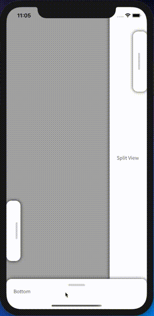

# Xamarin.Forms.DragView
*A draggable pane component for Xamarin.Forms*

iOS only at the moment - technically works on Android but judders.



NuGet package available at https://www.nuget.org/packages/Xamarin.Forms.DragView/

## Usage

Import the DragView assembly:
```xaml
xmlns:dragview="clr-namespace:Xamarin.Forms.DragView;assembly=Xamarin.Forms.DragView"
```

Place your DragView inside an AbsoluteLayout, dock it to one of the edges and set the DragDirection property.

The following example docks the DragView to the bottom:
```xaml
<AbsoluteLayout>
    <dragview:DragView
        DragDirection="Up"
        MaxBounds="0.5"
        MinBounds="0.1"

        AbsoluteLayout.LayoutFlags="PositionProportional, WidthProportional"
        AbsoluteLayout.LayoutBounds="0.5, 1, 1, AutoSize">

        <!-- Your controls... -->
    </dragview:DragView>
</AbsoluteLayout>
```

DragDirection can be Up, Left, Down or Right.
MinBounds and MaxBounds declare the minimum and maximum space the DragView can take up, denoted as percentages of the parent container's size.

See [DragView.xaml.cs](Xamarin.Forms.DragView/DragView.xaml.cs) for all bindable properties.

## More Examples

Here is the XAML for the DragView setups as seen in the demonstration image above:

```xaml
<AbsoluteLayout>
    <!-- split view on the right side of the screen, lacking swipe gesture -->
    <dragview:DragView
        DragDirection="Left"
        MinBounds="0.025"
        MaxBounds="1.0"
        StartBounds="0.33"
        SwipeThreshold="-1"
        CornerRadius="0"

        AbsoluteLayout.LayoutFlags="PositionProportional, HeightProportional"
        AbsoluteLayout.LayoutBounds="1, 0.5, AutoSize, 1">
        
        <Label Text="Split View on Right Side" VerticalOptions="Center" LineBreakMode="NoWrap" />
    </dragview:DragView>
    
    <!-- small drag view docked to the upper right of the screen -->
    <dragview:DragView
        DragDirection="Left"
        MaxBounds="0.8"

        AbsoluteLayout.LayoutFlags="PositionProportional, HeightProportional"
        AbsoluteLayout.LayoutBounds="1, 0.1, AutoSize, 0.2">
        
        <Label Text="Right" VerticalOptions="Center" />
    </dragview:DragView>

    <!-- small drag view docked to the lower left of the screen, with a stop gap at half way -->
    <dragview:DragView
        DragDirection="Right"
        MaxBounds="0.8"
        StopGapBounds="0.4"

        AbsoluteLayout.LayoutFlags="PositionProportional, HeightProportional"
        AbsoluteLayout.LayoutBounds="0, 0.8, AutoSize, 0.2">
        
        <Label Text="Left" VerticalOptions="Center" HorizontalOptions="End" />
    </dragview:DragView>

    <!-- drag view docked to the bottom of the screen -->
    <dragview:DragView
        DragDirection="Top"

        AbsoluteLayout.LayoutFlags="PositionProportional, WidthProportional"
        AbsoluteLayout.LayoutBounds="0.5, 1, 1, AutoSize">
        
        <Label Text="Bottom" />
    </dragview:DragView>
</AbsoluteLayout>
```
